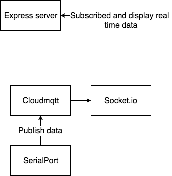

# GYM COUNT V2.0 (WDI project 4)

## Objective
•Build a realtime crowd count

•Expose myself to using websocket(socket.io) and cloudmqtt

•Revise on node js

•Resource finding and solving problems on my own

•Introduce myself to rfid reader via npm Serialport

## Updates in Functionalities

•Able to add, login and logout Customer

•Each Customer tagged to a rfid

•Tracking of crowd in the gym

#Code for mqtt

```
var client = mqtt.connect('mqtt://m10.cloudmqtt.com', options

var client = mqtt.connect('mqtt://m10.cloudmqtt.com', options)
client.on('connect', function () {
  myPort.on('data', function (data) {
    client.publish('topic1', data, function () {
      console.log(typeof data)
      console.log('Message is published ' + data)
    })
    })
}) //published in local computer

client.on('connect', function () { // When connected
  console.log('connected')
    // subscribe to a topic
  client.subscribe('topic1/#', function () {
        // when a message arrives, do something with it
    client.on('message', function (topic, message, packet) {
      console.log("Received '" + message + "' on '" + topic + "'")
```

## Built with

•Express Node Js

•Bootstrap

•Mongoose MongoDB

•Cloudmqtt(V2)

•Socket.io(V2)

•Serialport(V2)

## Flowchart


## Improvement

•Aesthetic of the website

•Add more interactive rating system

•TDD

•Separate Mqtt and socket.io codes into different js file(currently in app.js)

•Work on a Arudino that transmit signal wirelessly to cloudmqtt instead of using serialport npm

•Use react js to build the front-end

•Refactoring of codes
## Reference
Socket.io Docs: https://socket.io/

Serialport npm:https://www.npmjs.com/package/serialport

CloudMqtt : https://www.cloudmqtt.com/

## Heroku Deployment

url(https://gymcount.herokuapp.com/)
